# 创建群组
`android逆向与安全`

---


# 前言
1 本文仅以一个功能为例，从0到1的详细的还原以前的分析学习过程中的细节。其余所有功能的学习以及代码，同样都在本地笔记中。

## A.流程

- [01.流程试玩]()
- [02.需求分析与拆解]()
- [03.逆向分析与学习过程]()
- [04.业务逻辑初步实现]()
- [05.实现代码自我测试]()
- [06.细节更进一步分析]()
- [07.性能考虑]()
- [08.用户行为模拟]()
- [09.合并到大code]()
- [10.真实环境测试，以及极限性能测试]()
---

# 03.整个业务逻辑分析
反复不断的尝试建群，测试到的建立公开群的规则：
- a 一个人也能建群成功，并且只有你自己，也能建群成功。
- b 邀请你和官方的任何账号都可以
- c 邀请你和任何数量的人都可以
- d 默认都是需要确认的，并且在通知那里有一个群邀请信息通知的选项。
- e 下面有明确的提示：每次聊天最多邀请499人，并且特么好像都是受邀模式。
- 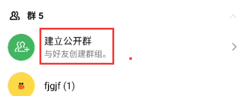
- 刚看到建群的地方也有一个创建 聊天？？
- 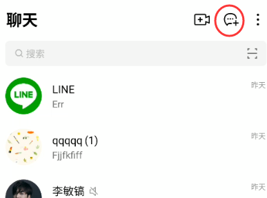
- 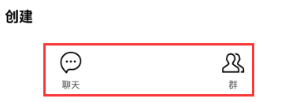
- 哦，那个建立聊天就是把会话建立出来。。
- 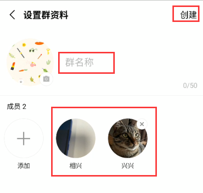
- buttonId：jp.naver.line.android:id/header_button_text
- 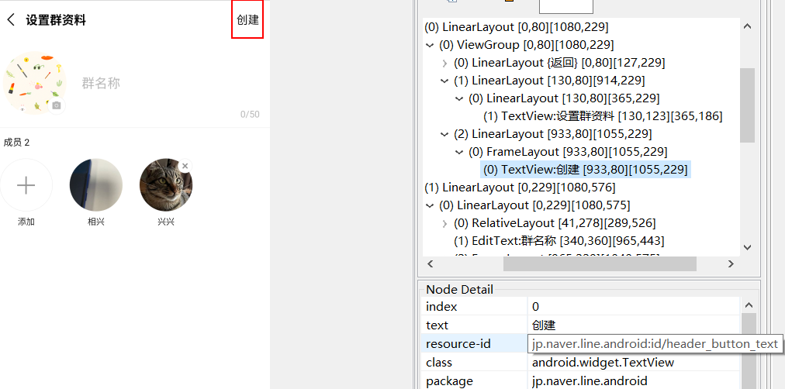
- 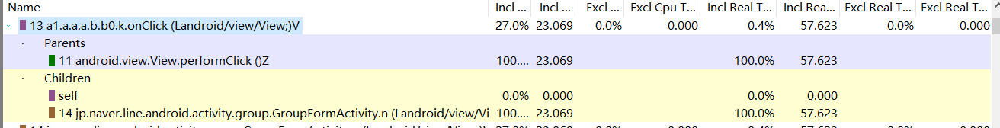
- hook一下，有了
- 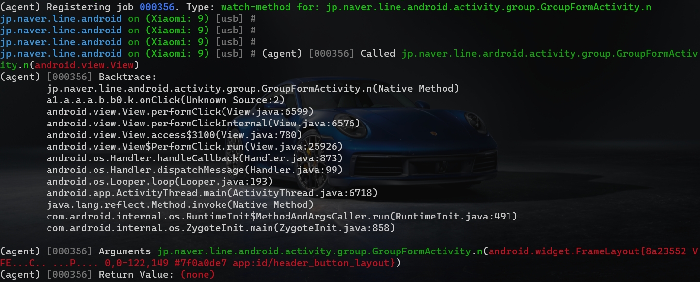
- 核心逻辑：
- 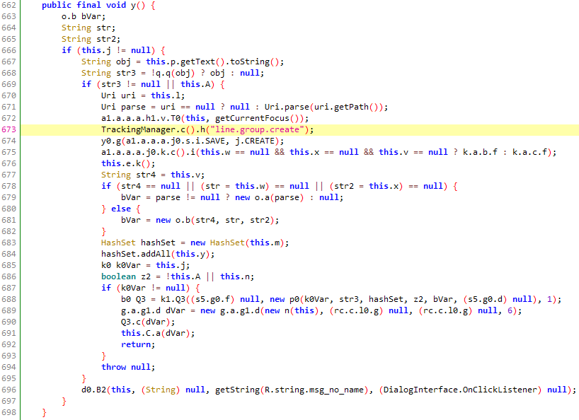
- 手动输入，然后call一下y方法，建群完毕，但是要实现完全无感的方式建群，所以继续分析所有逻辑。


建群逻辑分析：

- 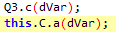
- 上面两个分别测试一下就知道了，因为一开始看不出是哪个包含业务逻辑。
    - g.a.g1.a.a方法测试，无效。
    - Q3测试，先确定Q3变量的类型。
        - a1.a.a.a.s2.k1.Q3 --dump-return
        - return value:rc.c.m0.e.f.b@13431c1

    - 所以就是rc.c.m0.e.f.b.c方法，这个c方法是在rc.c.m0.e.f.b的父类一个abstact类中
        - 【object dump一下看看。objdump了一下，毛都没有】
        - 把这个Q3.c return 了之后，Dialog 直接 转圈卡死，本来是有网络请求的
- 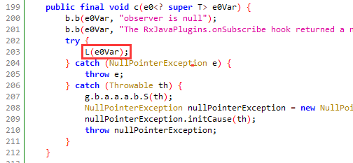
- 所以就是rc.c.m0.e.f.b的L方法。再试一下
- 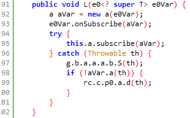
- 经过测试，就是这个L方法。
- L方法分析：
- 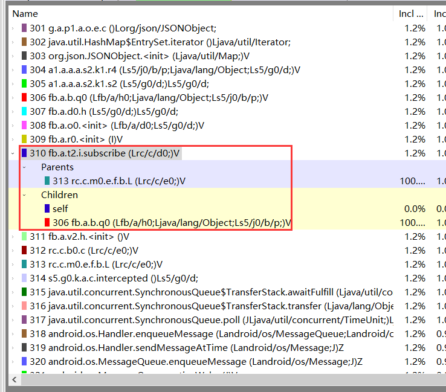
- fb.a.t2.i.subscribe
还特么真是，我艹
- 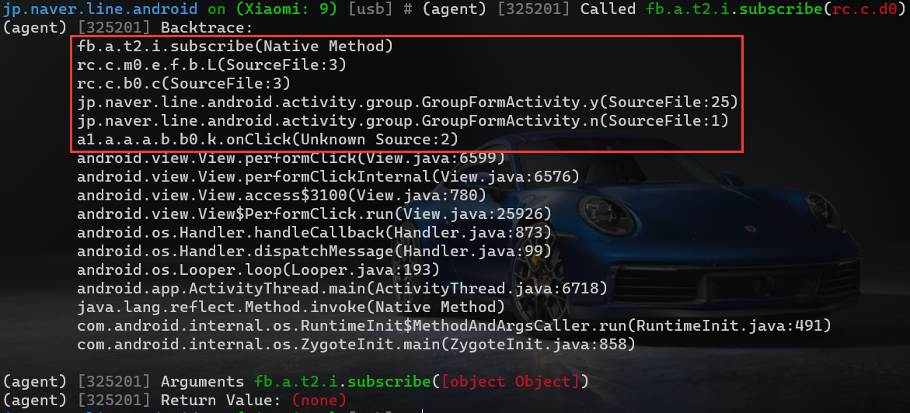
- 逻辑入口确认：继续分析，就是这个方法：
    - fb.a.t2.i.subscribe
- 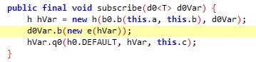
- 分析第一个b方法：
    - 然后上面已经初步确定那个q0是核心逻辑，然后大概看了一下那个q0，特么有点非常复杂。所以先看一下那个b方法，b方法大概看了一下，hVar是ui的dialog相关的取消确认回调啥的，继续调试一下：
- 确认参数 d0Var一路跟踪是这个：
- 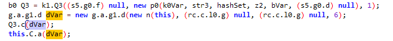
- d0Var：g.a.g1.d
- 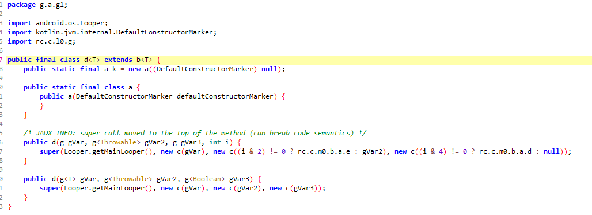
- 然后看下b方法。妈的，上面那个dVar是下面的a
- 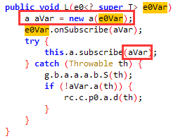
- 所以那个b方法是rc.c.m0.e.f.b$a中的b方法。
- 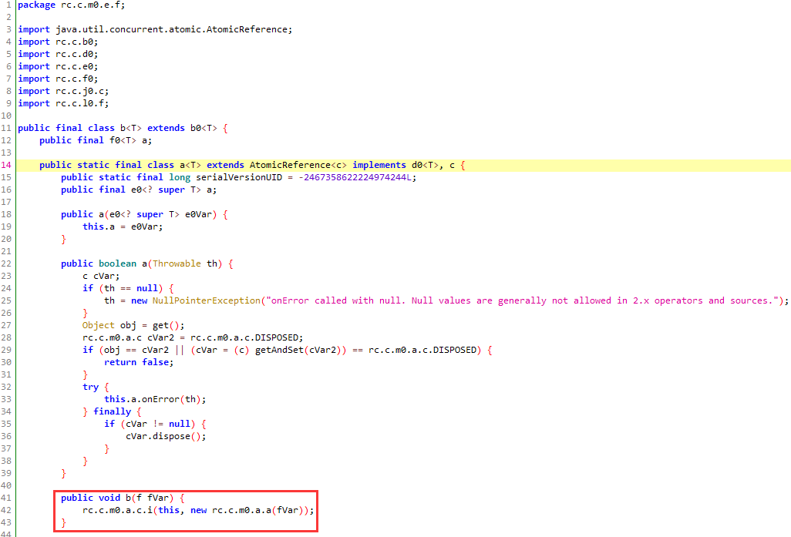
- 这个就对了。
- 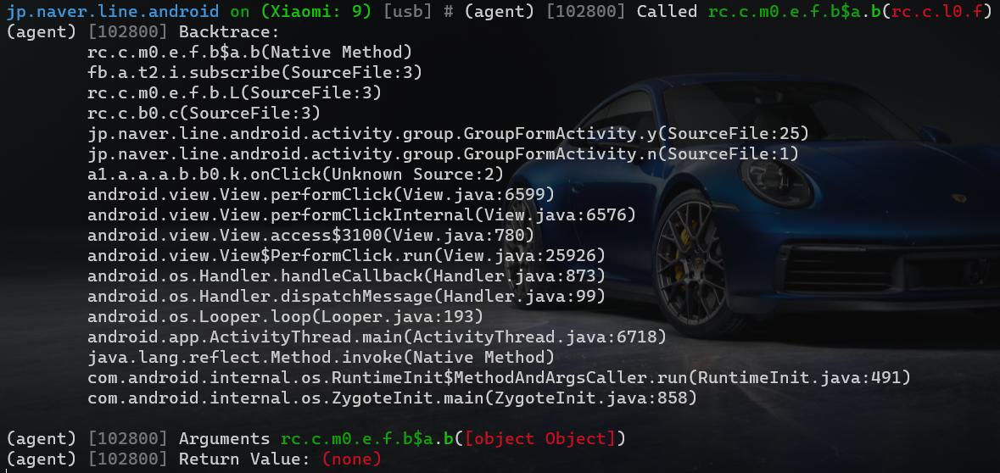
- 经过确认，这个b方法不影响业务逻辑。

核心逻辑分析：
- fb.a.t2.i.subscribe的q0方法。
- 
- 就是fb.a.b.q0方法
- 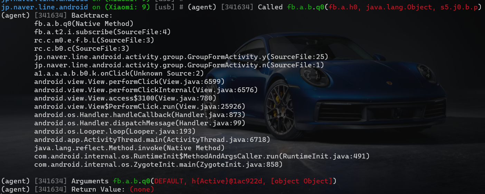
- 判断一下走哪个：
- 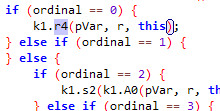
- a1.a.a.a.s2.k1.r4
- a1.a.a.a.s2.k1.s2
- 全都有就有点优秀了，我艹。所以有可能是其他地方调用的某一个
- 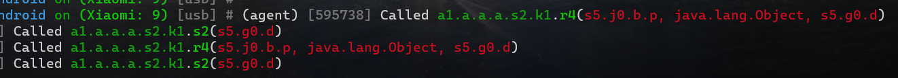
- 经过确认确实是。只有r4是在q0方法中调用的。
所以这里走的是第一个。也就是说即使哪个s2有调用，但是总入口还是从r4进去的。
- 也就是k1的r4方法，就是建群方法。
这个参数是啥玩意，怎么啥也没有。
- 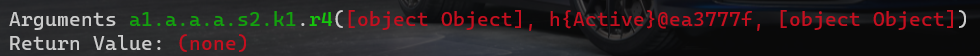
- 开始创建 调用两遍下面的
然后创建结束 返回网络失败  p1
- 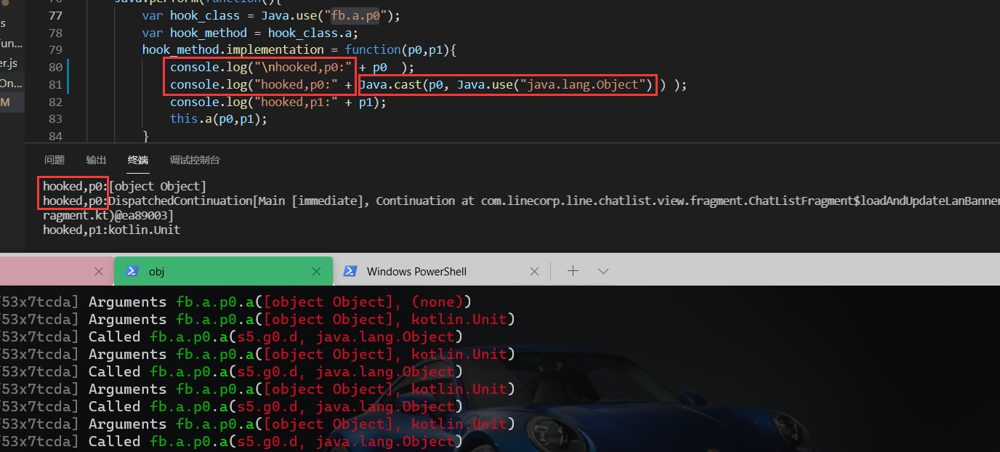
- 继续分析：
a1.a.a.a.s2.k1.r4
- 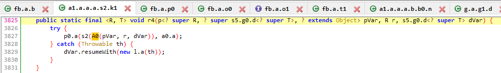
- r4参数
- 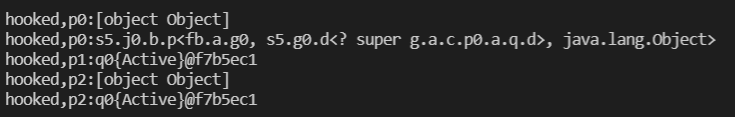
- 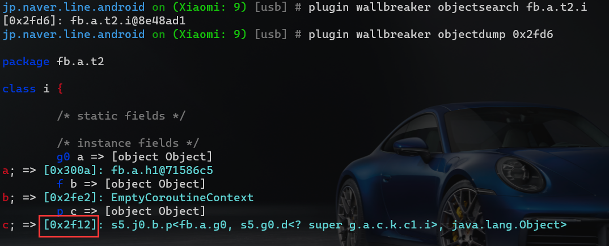
- 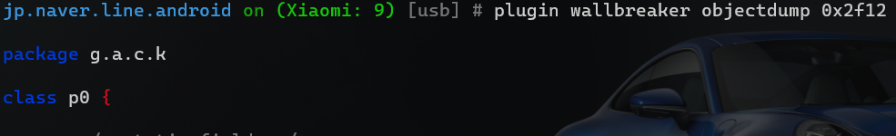
- 所以r4方法的参数pVar：s5.j0.b.p，的实现是
g.a.c.k.p0
- 下面那个群就是刚才创建的群：
- 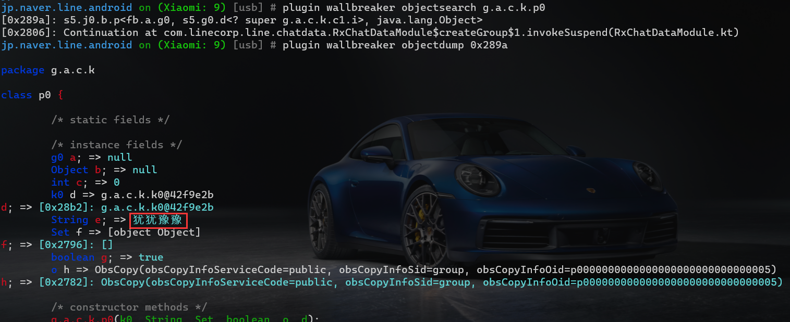
- 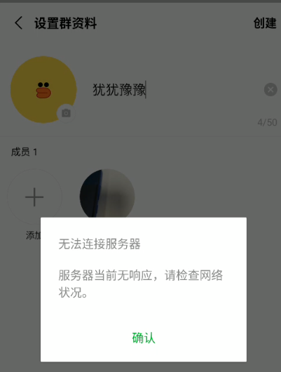
- 猜测一下后面两个参数是一样的， 估计就是下面的h
    - h：fb.a.t2.h
- 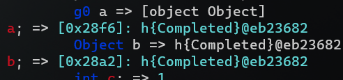

- 直接使用Object测试一下：
    - 建群需要：
        - a 输入一个群名字
        - b 等待建群结果
        - c 返回建群结果，成功返回群id，失败返回失败原因。
- smali_classes7/fb/a/y0.smali:    const-string v1, "Active"
- 会调用两次，一个h，一个q0。
- 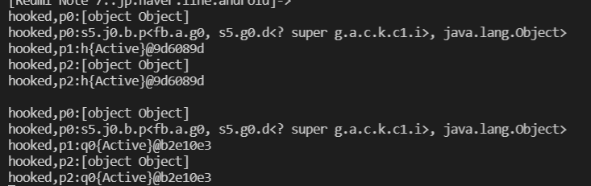
- 直接拿第一次那个h对象进行测试就行。并且可以看到后面两个参数是一模一样的。
- 第一个参数的参数。
- 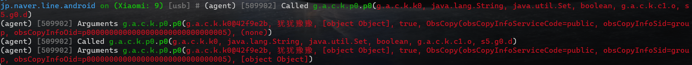
- 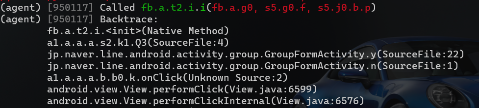
- 就是Q3的第2个参数
- 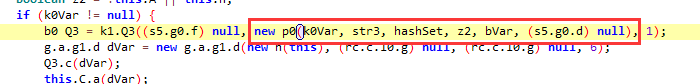
- 所以这里就是直接new了一个p0对象。
把这个new的对象的参数挨个调试一下。
第二个参数
HashSet hashSet = new HashSet(this.m);
List<String> m = new ArrayList();
所以如果没有就是默认自己。如果有就是额外选中的人的id。真实参数如下：
- 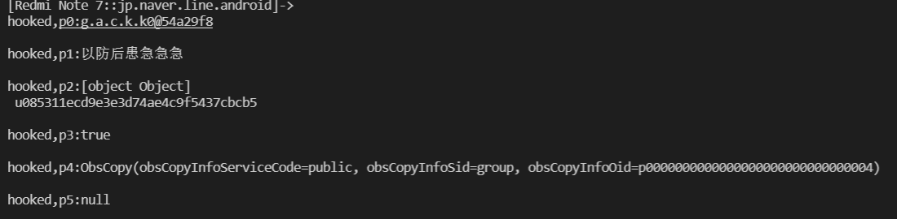
- 还剩第一个参数：hooked,p0:g.a.c.k.k0@54a29f8
- 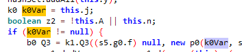
- 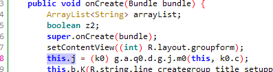
- k0.c是特么static的。所以所有参数已经ok了。
- 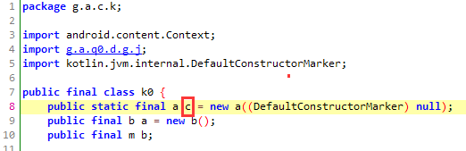
- 已经全部分析完毕。又回到了这个Q3.c方法。
- 就是从那个y方法中的Q3.c一路跟进去到最后那里，已经在上面分析过了。
Q3.c(dVar);

最终实现完全无感建群：

- 只差这一个参数，new n(this)
- 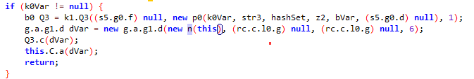
- 分析这个参数：
就是创建了这么一个类，需要确认一下那个accept有没有走，因为这个accept用到了特定的Activity:GroupFormActivity
a1.a.a.a.b.b0.n.accept
- 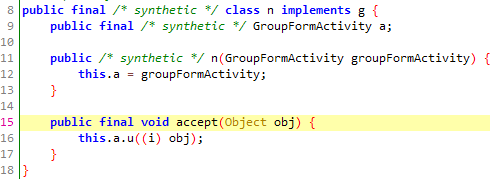
- 到最后创建完了之后，调用了accept方法。
通过使用obj进行区分创建结束之后的数据。
- 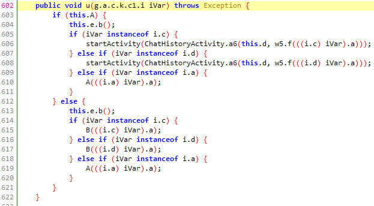
- 并且可以看到i类中就是用上面的内部类进行区分不同的建群结果。
- 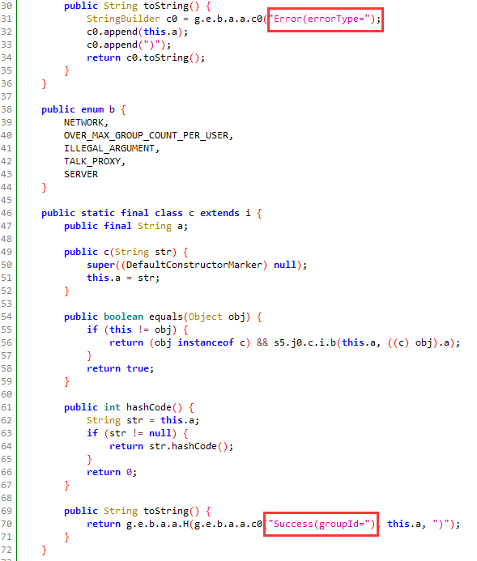
- 并且在这里包含了 groupId ，这就是建群操作需要的返回值。
- 所以策略就是，如果是通过指令创建群的话，直接给他把accept方法绕过去，但是拿到accept的参数，这个参数是服务器的返回值。进行人工区分即可。
- 打印查看一下参数：
    - jp.naver.line.android.activity.group.GroupFormActivity.u
- 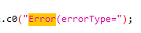
- 所以i.a是error，并且必定包含：Error(errorType=
- 
- 失败原因一共有：
- 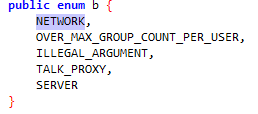
- 成功的话，必定包含：
- 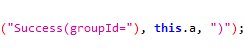
- 或者这个：
    - 所以下面这个应该是用系统头像走的路径啊。。
- 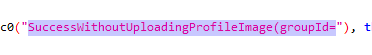
- 测试一下，一共就这么多情况。
- 注意，有一个else。这里看起来像直接跳转到某一个联系人或者群的页面啥的。
- 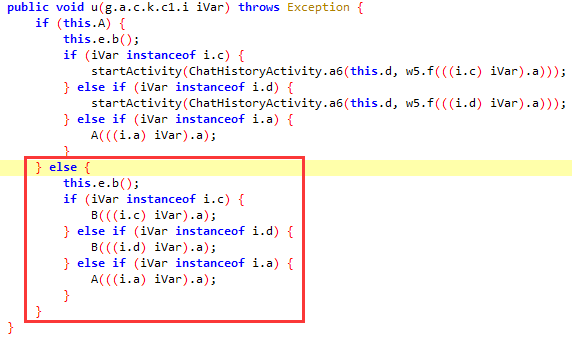
- 并且A=false。
- 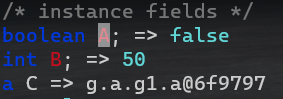
- 未连接vpn的话，全部都是走的A方法报错，弹出一个错误对话框。
jp.naver.line.android.activity.chathistory.ChatHistoryActivity.a6
连接上VPN之后，把B和a6都hook了，发现特么走的居然是B，沃日
- 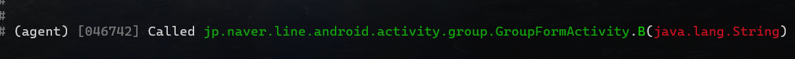
- 经过更进一步的确认。从主页的群列表点进去一个群是走的上面。而建群的时候是走的下面。
【所以这里实际上是等于有两个可以跳转到指定群的方法，测试一下：】

最终实现：
- 所以这种无感的，可以提供两种最终呈现方式：
- 第1步：先给他使用原来的流程，报错对话框啊，跳转啥的
需要确定this.l,this.v这两个变量。
this.l是特么头像：
- 
- this.v=String public
- 
- 所以可以看出来刚好，如果v w x 有一个为空，那么下面就要创建一个new o.a 刚好就是用parse制定的头像uri去上传？
- 
- 
- 哦，所以那个obsCopy就是复制一个现成的头像。
- 
- 所以到这里，那个p0就是包含了建群的所有参数，比如：
名称、头像、要建群的人。
- 继续：
    - 所以就是走的第二个else嘛，然后恰好就是上面dump到的v w x三个String参数。
    -  String v; => public
    -  String w; => group
    -  String x; => p0000000000000000000000000000003

- 所有参数搞定。开始创建：先创建p0，然后创建Q3，然后调用Q3.c方法，建群完毕。
简单测试一下，一波成功。然后更进一步的去区分服务器的返回值。

- 第2步：
    - 自动绕过所有ui显示，并成功创建。并且返回到正确的处理结果：
失败，返回失败原因。
成功，可以选择是否进行跳转到群。【这里可以选择是否需要跳转】
屏蔽错误对话框，正确的话，就跳转到群，并拿到群id。
（有可能需要深入y去追到y的最后的方法【经过验证，并不需要】）

最终测试：
- 
- 
- 

【【【【【【收工，全流程，所有参数分析完毕】】】】】】


- 最终的实现脚本：
```
/*
*   无感方式建群，并获取服务器返回的建群结果
*/

var createResult = false;

function getServerReturn(){
    createResult = true;
    console.log("__will hook server return__!!")
    Java.perform(function(){
        var hook_class = Java.use("a1.a.a.a.b.b0.n");
        var hook_method = hook_class.accept;
        hook_method.implementation = function(p0){
            console.log("\n server return p0:" + p0  );
            console.log("\n server return p0:" + Java.cast(p0, Java.use("java.lang.Object") )  );

            //this.accept(p0);//这里通过判断服务器的返回值，更改UI是否需要显示
            //这里更进一步的去区分和控制ui的显示。就是如果有错就显示错误对话框，如果没错就跳转到创建成功的群，或者特么不跳？？
            if(  Java.use("java.lang.String").$new(p0.toString() + "" ).contains( Java.use("java.lang.String").$new("Error(errorType=") )   ){
                console.log(" 建群失败，失败原因：" + Java.cast(p0, Java.use("g.a.c.k.c1.i$a")).a.value );     
            }else if(   Java.use("java.lang.String").$new(p0.toString() + "" ).contains( Java.use("java.lang.String").$new("Success(groupId=") )   ){
                console.log(" 建群成功，群id   ："  + Java.cast(p0, Java.use("g.a.c.k.c1.i$c")).a.value ); 
            }else if(    Java.use("java.lang.String").$new(p0.toString() + "" ).contains( Java.use("java.lang.String").$new("SuccessWithoutUploadingProfileImage(groupId=") )    ){
                console.log(" 建群成功，群id   ：" + Java.cast(p0, Java.use("g.a.c.k.c1.i$d")).a.value );
            }

        }  
    });
}

function createGroup( name ){
    Java.perform(function(){
        Java.choose("jp.naver.line.android.activity.group.GroupFormActivity",{
            onMatch(GroupFormActivity){
                console.log("__ find GroupFormActivity object __");
    
                if( !GroupFormActivity.isResumed()){
                    console.log("__wrong GroupFormActivity,just return!!!");
                    return;
                }

                if( name == "" || name == null ){
                    console.log("请输入群名称")
                    return;
                }

                if( !createResult ){//XPosed里面放到统一的位置
                    getServerReturn();
                }

                //建群列表：
                var users_set = Java.use("java.util.HashSet").$new();
                var users_list = Java.use("java.util.ArrayList").$new();
                users_list.add("u085311ecd9e3e3d74ae4c9f5437cbcb5");//Line官方账号
                users_set.addAll(users_list);

                //建群
                var jRunnable = Java.use('java.lang.Runnable');
                var MyRunnable = Java.registerClass({
                        name: 'com.example.MyRunnable',
                        implements: [jRunnable],
                        methods: {
                            run: function(){
                                console.log("___before create group___")

                                //step 1:create Q3
                                var p0_Q3 = null;
                                        var m0_p1 = Java.use("g.a.c.k.k0").c.value;
                                        if( m0_p1 == null ){
                                            console.log("__need reflect to get object c");
                                            return;
                                        }
                                    var p1_Q3_p0 = Java.use("g.a.q0.d.g.j").m0(GroupFormActivity,m0_p1);
                                    var p1_Q3_p1 = name;
                                    var p1_Q3_p2 = users_set;
                                    var p1_Q3_p3 = true
                                        //头像
                                    var p1_Q3_p4 = Java.use("g.a.c.k.c1.o$b").$new("public","group","p0000000000000000000000000000003");
                                    var p1_Q3_p5 = null;
                                var p1_Q3 = Java.use("g.a.c.k.p0").$new(p1_Q3_p0,p1_Q3_p1,p1_Q3_p2,p1_Q3_p3,p1_Q3_p4,p1_Q3_p5);
                                var p2_Q3 = 1;
                                
                                var Q3 = Java.use("a1.a.a.a.s2.k1").Q3(p0_Q3,p1_Q3,p2_Q3);    

                                //step 2:Q3.c
                                var dVar = Java.use("g.a.g1.d").$new( Java.use("a1.a.a.a.b.b0.n").$new(GroupFormActivity) ,null ,null ,6 );
                                Q3.c(dVar)

                                console.log("__CALL group Create success __");
                            }
                        }
                    });
                var runnable = MyRunnable.$new();
                GroupFormActivity.runOnUiThread( runnable );

            }, 
            onComplete(){
            }
        });
    })
}

```


---

# 其余细节学习

- 建立私有群？
- 联系人不在列表
    - a 又传了一遍自己。
    - b 传的联系人不是自己好友。
    - c 别传了一个群的id，因为line的群id和个人id非常像，不像微信，格式都不一样。
    - d 最多能传多少个联系人。
- 创建群人数上限限制。
- 群名称长度限制。
- 群头像：line的群头像可以进行自定义设置。
- 建群频率限制。
- line version 11.3.1，其他版本大同小异