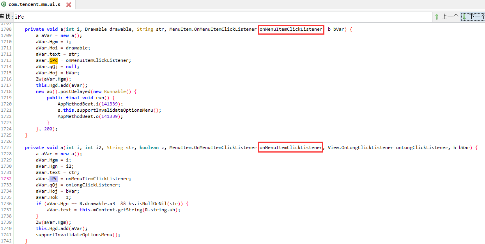

# 发送图片
`android逆向与安全`

---


# 前言
1 本文仅以一个功能为例，从0到1的详细的还原以前的分析学习过程中的细节。其余所有功能的学习以及代码，都在本地笔记中。


2 Xlog 5秒定位的方法就不写了，没啥技术含量，这里主要从0到1的如何一步一步的庖丁解牛的分析全流程，并在分析流程的过程中学习优秀的代码设计理念以及细节思考，恩。

## A.流程

- [01.流程试玩]()
- [02.需求分析与拆解]()
- [03.逆向分析与学习过程]()
- [04.业务逻辑初步实现]()
- [05.实现代码自我测试]()
- [06.细节更进一步分析]()
- [07.性能考虑]()
- [08.用户行为模拟]()
- [09.合并到大code]()
- [10.真实环境测试，以及极限性能测试]()
---

# 03.整个业务逻辑分析
- 在发送图片界面，点击照片
- 
- 跳转到图片选择界面
- 
- dumpsys定位到当前的Activity AlbumPreviewUI
- 
搜索类的时候，如果遇到反编译不出来的情况，可以直接在smali中搜索，或者尝试其他工具，比如cfr、jeb、Procyon等。
- 直奔主题，选一张图片
- 
- 然后右上角的发送变为可见可点
- 
- 用ddms拿到button的id 为 ch
- 
- 对于这个ch的使用，有两种方法，第1种直接进行搜索 R.id.ch 。寻找Button类型的变量
- 
- 
- 
- 使用frida直接进行验证，然后进行随便点选一张图片，发现有调用，即入口就是这里
- 
- 第二种 反编译不出来情况下，直接搜索smali 从资源索引列表里面查找，类型为id的值
- 
- 0x7f090076 = 2131296374 然后再根据这个10进制数值，也可找到
- 
- 
- 接下来，就是当点击发送之后，追踪后面的业务代码，也就是这个方法
- 
- 
- 也就是这个iPc的 onMenuItemClick方法
- 
- 所以就是去找iPc的赋值，也就是这个参数 
- 
- 然后像这种回调的赋值，一般都是在创建这个类的时候就进行了赋值保存
- 
- 所以退出，重新从发送图片的流程开始 点击+号，然后点击相册，出现调用堆栈如下
- 
- 即实现类是 com.tencent.mm.plugin.gallery.ui.AlbumPreviewUI$12 查看一下smali代码
- 
- 然后大概看一下这个AlbumPreviewUI$12 里面的onMenuItemClick
- 
- 就是这个
- 
- 在内存里面 dump 一下
- 
- 进一步确认就是这个
- 
- 再次进行验证，没有问题
- 
- 到这里的话，逻辑功能点已经跟踪到了，就是这里。


- 接下来进一步分析流程，然后找到最终的业务逻辑执行的地方。
- 

- 用frida调试。
- 

- itemId = 0 ，所以上面的整个click之后，就只走了那个cBu方法
- 

- cBu方法分析：详见上面反编译出来的那个代码。反编译的代码如下：

```
   /* access modifiers changed from: protected */
    public boolean cBu() {
        int i;
        int bcE;
        int i2 = 0;
        AppMethodBeat.i(111475);
        ac.d("MicroMsg.AlbumPreviewUI", "send image, previewImageCount:%d, chooseForTimeline:%b", Integer.valueOf(com.tencent.mm.plugin.gallery.model.e.cMA()), Boolean.valueOf(this.sPw));
        com.tencent.mm.plugin.gallery.a.d.bi(11610, (this.sPw ? 3 : 2) + "," + com.tencent.mm.plugin.gallery.model.e.cMA());
        if (this.sPI < 0) {
            this.sPI = com.tencent.mm.plugin.gallery.a.d.ZH();
        }
        com.tencent.mm.plugin.gallery.model.e.cMz();
        if (this.sPl.cNv().size() == 0) {
            ac.i("MicroMsg.AlbumPreviewUI", "onMenuItemClick");
            setResult(-2);
            finish();
            AppMethodBeat.o(111475);
        } else {
            Intent intent = new Intent();
            int i3 = this.sPO;
            if (this.sPB) {
                i3 = 1;
            }
            if (22 == com.tencent.mm.plugin.gallery.model.e.cMt().kxr) {
                ArrayList<GalleryItem.MediaItem> arrayList = this.sPl.sOK;
                ArrayList arrayList2 = new ArrayList();
                ArrayList arrayList3 = new ArrayList();
                int[] iArr = new int[this.rXO];
                Iterator<GalleryItem.MediaItem> it = arrayList.iterator();
                while (it.hasNext()) {
                    GalleryItem.MediaItem next = it.next();
                    if (next.getType() == 1) {
                        if (!next.mMimeType.equals("edit") || bs.isNullOrNil(next.sKj)) {
                            arrayList2.add(next.sKh);
                        } else {
                            arrayList2.add(next.sKj);
                        }
                        iArr[i2] = 1;
                        i2++;
                    } else if (next.getType() == 2) {
                        arrayList3.add(next.sKh);
                        iArr[i2] = 2;
                        i2++;
                    }
                }
                boolean cOc = com.tencent.mm.plugin.gallery.a.d.cOc();
                if (com.tencent.mm.plugin.recordvideo.activity.a.b.n(arrayList2, arrayList3) != 4 || !cOc) {
                    intent.putStringArrayListExtra("key_select_video_list", arrayList3);
                    intent.putStringArrayListExtra("key_select_image_list", arrayList2);
                    setResult(-1, intent);
                    finish();
                    AppMethodBeat.o(111475);
                } else {
                    VLogPreloadUI.a aVar = VLogPreloadUI.sTO;
                    VLogPreloadUI.a.a(this, arrayList3, arrayList2, iArr);
                    AppMethodBeat.o(111475);
                }
            } else {
                if (i3 == 1) {
                    intent.putExtra("CropImage_Compress_Img", this.sPw || !this.opQ);
                    ArrayList<GalleryItem.MediaItem> arrayList4 = this.sPl.sOK;
                    ArrayList arrayList5 = new ArrayList();
                    Iterator<GalleryItem.MediaItem> it2 = arrayList4.iterator();
                    while (it2.hasNext()) {
                        GalleryItem.MediaItem next2 = it2.next();
                        if (!next2.mMimeType.equals("edit") || bs.isNullOrNil(next2.sKj)) {
                            arrayList5.add(next2.sKh);
                        } else {
                            arrayList5.add(next2.sKj);
                        }
                    }
                    intent.putStringArrayListExtra("CropImage_OutputPath_List", arrayList5);
                    intent.putExtra("KSelectImgUseTime", System.currentTimeMillis() - this.sPH);
                    this.sPH = 0;
                    setResult(-1, intent);
                    if (!bs.isNullOrNil(this.sOM) && this.sOM.equals("album_business_bubble_media_by_coordinate")) {
                        intent.putExtra("CropImage_Compress_Img", false);
                    }
                    if (bs.Gn() - this.sPG < 1000) {
                        ac.w("MicroMsg.AlbumPreviewUI", "sendImg btn event frequency limit");
                        AppMethodBeat.o(111475);
                    } else {
                        ac.i("MicroMsg.AlbumPreviewUI", "QUERY_TYPE_IMAGE switch to SendImgProxyUI");
                        this.sPG = bs.Gn();
                        if (bs.isNullOrNil(this.dng) || "medianote".equals(this.toUser)) {
                            finish();
                        } else {
                            intent.setClassName(this, "com.tencent.mm.ui.chatting.SendImgProxyUI");
                            intent.putExtra("GalleryUI_FromUser", this.dng);
                            intent.putExtra("GalleryUI_ToUser", this.toUser);
                            startActivityForResult(intent, 4373);
                        }
                    }
                } else if (i3 == 2) {
                    ac.i("MicroMsg.AlbumPreviewUI", "onMenuItemClick video");
                    if (getIntent().getBooleanExtra("GalleryUI_SkipVideoSizeLimit", false)) {
                        bcE = 0;
                    } else {
                        com.tencent.mm.plugin.gallery.ui.a.a agH = com.tencent.mm.plugin.gallery.ui.a.a.agH(this.sPl.cNv().get(0));
                        agH.mSize = this.sPI;
                        bcE = agH.bcE();
                    }
                    if (bcE == 0) {
                        intent.setData(m.a(getContext(), new com.tencent.mm.vfs.e(this.sPl.cNv().get(0))));
                        intent.putStringArrayListExtra("key_select_video_list", this.sPl.cNv());
                        setResult(-1, intent);
                        finish();
                    } else if (bcE == 2) {
                        com.tencent.mm.ui.base.h.l(this, R.string.g82, R.string.cpm);
                        ac.w("MicroMsg.AlbumPreviewUI", "video is import error");
                        AppMethodBeat.o(111475);
                    } else {
                        com.tencent.mm.ui.base.h.l(this, R.string.cpl, R.string.cpm);
                        ac.w("MicroMsg.AlbumPreviewUI", "video is over size");
                        AppMethodBeat.o(111475);
                    }
                } else if (i3 != 3) {
                    ac.i("MicroMsg.AlbumPreviewUI", "onMenuItemClick default");
                    setResult(-2);
                    finish();
                } else if (!bs.isNullOrNil(this.sOM) && this.sOM.equals("album_business_bubble_media_by_coordinate")) {
                    ArrayList<GalleryItem.MediaItem> arrayList6 = this.sPl.sOK;
                    ArrayList arrayList7 = new ArrayList();
                    ArrayList arrayList8 = new ArrayList();
                    Iterator<GalleryItem.MediaItem> it3 = arrayList6.iterator();
                    while (it3.hasNext()) {
                        GalleryItem.MediaItem next3 = it3.next();
                        if (next3.getType() == 1) {
                            if (!next3.mMimeType.equals("edit") || bs.isNullOrNil(next3.sKj)) {
                                arrayList8.add(next3.sKh);
                            } else {
                                arrayList8.add(next3.sKj);
                            }
                        } else if (next3.getType() == 2) {
                            arrayList7.add(next3.sKh);
                        }
                    }
                    intent.putExtra("CropImage_Compress_Img", false);
                    intent.putStringArrayListExtra("CropImage_OutputPath_List", arrayList8);
                    intent.putStringArrayListExtra("key_select_video_list", arrayList7);
                    intent.putExtra("KSelectImgUseTime", System.currentTimeMillis() - this.sPH);
                    intent.putExtra("longitude", this.longitude);
                    intent.putExtra("latitude", this.latitude);
                    this.sPH = 0;
                    setResult(-1, intent);
                    finish();
                    AppMethodBeat.o(111475);
                } else if (bs.Gn() - this.sPG < 1000) {
                    ac.w("MicroMsg.AlbumPreviewUI", "sendImg btn event frequency limit");
                    AppMethodBeat.o(111475);
                } else {
                    this.sPG = bs.Gn();
                    ArrayList<GalleryItem.MediaItem> arrayList9 = this.sPl.sOK;
                    ArrayList arrayList10 = new ArrayList();
                    ArrayList arrayList11 = new ArrayList();
                    int[] iArr2 = new int[this.rXO];
                    Iterator<GalleryItem.MediaItem> it4 = arrayList9.iterator();
                    int i4 = 0;
                    while (it4.hasNext()) {
                        GalleryItem.MediaItem next4 = it4.next();
                        if (next4.getType() == 1) {
                            if (!next4.mMimeType.equals("edit") || bs.isNullOrNil(next4.sKj)) {
                                arrayList11.add(next4.sKh);
                            } else {
                                arrayList11.add(next4.sKj);
                            }
                            iArr2[i4] = 1;
                            i4++;
                        } else {
                            if (next4.getType() == 2) {
                                arrayList10.add(next4.sKh);
                                i = i4 + 1;
                                iArr2[i4] = 2;
                            } else {
                                i = i4;
                            }
                            i4 = i;
                        }
                    }
                    intent.putExtra("CropImage_Compress_Img", this.sPw || !this.opQ);
                    intent.putStringArrayListExtra("key_select_video_list", arrayList10);
                    intent.putExtra("KSelectImgUseTime", System.currentTimeMillis() - this.sPH);
                    if (!this.sPw) {
                        this.sPH = 0;
                        if (arrayList11.size() > 0) {
                            intent.setClassName(this, "com.tencent.mm.ui.chatting.SendImgProxyUI");
                            intent.putStringArrayListExtra("CropImage_OutputPath_List", arrayList11);
                            intent.putExtra("GalleryUI_FromUser", this.dng);
                            intent.putExtra("GalleryUI_ToUser", this.toUser);
                            intent.putExtra("CropImage_limit_Img_Size", 26214400);
                            ac.i("MicroMsg.AlbumPreviewUI", "QUERY_TYPE_IMAGE_AND_VIDEO switch to SendImgProxyUI");
                            startActivityForResult(intent, 4373);
                        } else {
                            ac.i("MicroMsg.AlbumPreviewUI", "QueryTypeImageAndVideo");
                            setResult(-1, intent);
                            finish();
                        }
                    } else if (arrayList10.size() == 0) {
                        intent.putStringArrayListExtra("CropImage_OutputPath_List", arrayList11);
                        intent.putExtra("KSelectImgUseTime", System.currentTimeMillis() - this.sPH);
                        this.sPH = 0;
                        setResult(-1, intent);
                        finish();
                        AppMethodBeat.o(111475);
                    } else {
                        if (com.tencent.mm.plugin.recordvideo.activity.a.b.n(arrayList11, arrayList10) == 4) {
                            VLogPreloadUI.a aVar2 = VLogPreloadUI.sTO;
                            VLogPreloadUI.a.a(this, arrayList10, arrayList11, iArr2);
                        } else {
                            RecordConfigProvider ak = RecordConfigProvider.ak((String) arrayList10.get(0), "", "");
                            ak.wqC = getIntent().getIntExtra("key_edit_video_max_time_length", 10) * 1000;
                            ak.scene = 2;
                            VideoCaptureReportInfo videoCaptureReportInfo = new VideoCaptureReportInfo();
                            videoCaptureReportInfo.qwN = 1;
                            ak.wqK = videoCaptureReportInfo;
                            UICustomParam.a aVar3 = new UICustomParam.a();
                            aVar3.YX();
                            aVar3.YW();
                            aVar3.cN(true);
                            ak.wqu = aVar3.fKH;
                            com.tencent.mm.plugin.recordvideo.jumper.a aVar4 = com.tencent.mm.plugin.recordvideo.jumper.a.wqR;
                            com.tencent.mm.plugin.recordvideo.jumper.a.a(getContext(), 4379, R.anim.dv, -1, ak, 2, 0);
                        }
                        AppMethodBeat.o(111475);
                    }
                }
                AppMethodBeat.o(111475);
            }
        }
        return true;
    }
```


- 直接快速浏览这正好200行的代码，结构很清晰就是下面的这样

```
if(this.sPl.cNv().size() == 0){
}else{
    if(22 == com.tencent.mm.plugin.gallery.model.e.cMt().kxr){
    }else{
        if(i3 == 1){
        }else if(i3 == 2){
        } else if (i3 != 3) {
        } else if (!bs.isNullOrNil(this.sOM) && this.sOM.equals ("album_business_bubble_media_by_coordinate")) {
        } else if (bs.Gn() - this.sPG < 1000) {
        } else {
            if (!this.sPw) {

            } else if (arrayList10.size() == 0) {
            } else {
        }
    }
}
```

- 根据上面的代码结构，从一部分代码明文基本可以初步猜出来，核心的逻辑就是在上面的红色部分之间，也就是下面的代码

- 

- 进一步的确认流程，快速的确定上面走的是哪个流程，直接调试 android 的 intent.putExtra即可。经过确认就是走的上面的流程。

- 并且可以看到，下面这个参数值得引起注意（选择图片的耗时，通过很多功能逻辑的学习可以很容易发现，wechat会详细记录类似的ui操作参数以及轨迹等）

- 并且可以看到，下面这个参数值得引起注意（选择图片的耗时，通过很多功能逻辑的学习可以很容易发现，wechat会详细记录类似的ui操作参数以及轨迹等）
intent.putExtra("KSelectImgUseTime", System.currentTimeMillis() - this.sPH);

- 

- cBu方法分析完毕，可以看到启动了一个代理类  com.tencent.mm.ui.chatting.SendImgProxyUI

- SendImgProxyUI 分析
打开这个Activity，直接看onCreate，一眼可以看到红框里面显然就是业务逻辑，其他都是UI相关东西设置，比如那个isRunning，显然就是一个发送状态FLAG，并在业务逻辑完成的回调中设置为false，也就是同一发送任务只能执行一个。

- 

- 而且可以很明显的看出那个Runnable里面的核心功能实际上就是那三句，并且第三句只是设置了一下结果。

- 所以很清晰的思路就是把那个intent的extra模拟出来，然后去call那个a就行。即先看一下消息能否直接构建出来。

- 而且可以看到第一句的a方法的第一个参数Activity只是用来进行Toast的展示，所以可以直接传null。
然后第2个参数是一个Intent，所以进行参数调试，
即在 SendImgProxyUI  的 onCreate进行Intent获取。

- 简单写一下frida调试脚本如下

```
function getSendImgProxyUIIntentParams(){
    Java.perform(function(){
        var hook_class = Java.use("com.tencent.mm.ui.chatting.SendImgProxyUI");
        var hook_method = hook_class.onCreate;
        hook_method.implementation = function(p0){
            console.log("on create hooked");
            this.onCreate(p0);

            console.log("CropImage_Compress_Img      :" + this.getIntent().getBooleanExtra("CropImage_Compress_Img",true) );
            var key_select_video_list = this.getIntent().getStringArrayListExtra("key_select_video_list");
            if( key_select_video_list != null ){
                for(var i = 0 ; i < key_select_video_list.size(); i++){
                    console.log("key_select_video_list[" + i + "]=" + key_select_video_list.get(i).toString());
                }
            }else{
                console.log("key_select_video_list.size:" + key_select_video_list.size());
            }

            var CropImage_OutputPath_List = this.getIntent().getStringArrayListExtra("CropImage_OutputPath_List");
            if( CropImage_OutputPath_List != null ){
                for(var i = 0 ; i < CropImage_OutputPath_List.size(); i++){
                    console.log("CropImage_OutputPath_List[" + i + "]=" + CropImage_OutputPath_List.get(i).toString());
                }
            }

            // console.log("KSelectImgUseTime           :" + this.getIntent().getIntExtra("KSelectImgUseTime") );
            // console.log("GalleryUI_FromUser          :" + this.getIntent().getIntExtra("GalleryUI_FromUser") );
            console.log("GalleryUI_ToUser            :" + this.getIntent().getStringExtra("GalleryUI_ToUser") );
            console.log("CropImage_limit_Img_Size    :" + this.getIntent().getIntExtra("CropImage_limit_Img_Size",26214400) );
        }
    });
}

```

- 得到参数如下

- 

- 现在可以构造Intent，然后进行最终调用模拟。调试脚本如下
```
function sendPic(){
    Java.perform(function(){
        console.log("__START__");
        Java.choose("com.tencent.mm.ui.LauncherUI",{
            onMatch(LauncherUI){
                console.log("_find send obj_");

                var intent = Java.use("android.content.Intent").$new();
                var arrayList = Java.use("java.util.ArrayList").$new();
                arrayList.add("/storage/emulated/0/Pictures/WeiXin/mmexport1607494825447.jpg");
                //arrayList.add("/storage/emulated/0/Pictures/WeiXin/mmexport1607494824546.jpg");
                //arrayList.add("/storage/emulated/0/Pictures/WeiXin/mmexport1607494823372.jpg");
                intent.putStringArrayListExtra("CropImage_OutputPath_List",arrayList);
                intent.putExtra("CropImage_Compress_Img",true);
                intent.putExtra("GalleryUI_ToUser","Kurokkkky");
                intent.putExtra("CropImage_limit_Img_Size",26214400);

                var jRunnable = Java.use('java.lang.Runnable');
                var MyRunnable = Java.registerClass({
                        name: 'com.example.MyRunnable',
                        implements: [jRunnable],
                        methods: {
                            run: function(){
                                console.log("thread run...");
                                //参数1必须是 SendImgProxyUI ，从代码可见，这个Activity只做了一个Toast显示，所以直接传null，
                                Java.use("com.tencent.mm.ui.chatting.SendImgProxyUI").a(null,intent);
                                Java.use("com.tencent.mm.model.az").agU().eVm();
                                console.log("thread end...");
                            }
                        }
                    });
                var runnable = MyRunnable.$new();
                Java.use("com.tencent.mm.model.az").agU().az(runnable);
            }, 
            onComplete(){}
        });
    });
}
```

- 使用frida执行上面脚本测试，效果如下，一直卡在0%发送不出去
- 
- 所以这里并不是最终的业务逻辑发送地方，这里的功能只是生成这个缩略图和一个进度条（我淦）
所以三句中只有最后那一句setResult没有执行，故可以猜测是在Activity finish之后的onActivityResult中去做的。
- 
- 跟踪整个页面的启动流程，并快速确认是否在onActivityResult里面执行。
由于微信UI大量使用Fragment，所以直接把Activity和Fragment的生命周期全部hook，然后手动发送一张图片，就可以清晰的看到整个页面的流程变化，简单写一下调试脚本
```
function hook_Activity_onResume(){
    Java.perform(function(){
        var hook_class = Java.use("android.app.Activity");
        var hook_onResume = hook_class.onResume;
        hook_onResume.implementation = function(){
            console.log("\nActivity onResume      :[" + this.getClass().getName() + "]");

            this.onResume();                           
        }
    });
}

function hook_Activity_onPause(){
    Java.perform(function(){
        var hook_class = Java.use("android.app.Activity");
        var hook_onPause = hook_class.onPause;
        hook_onPause.implementation = function(){
            console.log("\nActivity onPause       :[" + this.getClass().getName() + "]");

            this.onPause();                           
        }
    });
}

function hook_v4Fragment_onResume(){
    Java.perform(function(){
        var hook_class = Java.use("android.support.v4.app.Fragment");
        var hook_onResume = hook_class.onResume;
        hook_onResume.implementation = function(){
            console.log("\nv4Fragment onResume    :[" + this.getClass().getName() + "]");

            this.onResume();                           
        }
    });
}

function hook_v4Fragment_onPause(){
    Java.perform(function(){
        var hook_class = Java.use("android.support.v4.app.Fragment");
        var hook_onPause = hook_class.onPause;
        hook_onPause.implementation = function(){
            console.log("\nv4Fragment onPause     :[" + this.getClass().getName() + "]");

            this.onPause();                           
        }
    });
}

function hookApp(){
    hook_Activity_onResume();
    hook_Activity_onPause();

    hook_v4Fragment_onResume();
    hook_v4Fragment_onPause(); 
}

setImmediate( hookApp )
```

- 可以清晰的看到整个流程的页面变化过程
- 
- 可以看到AlbumPreviewUI.onActivityResult 啥都没干，直接finish
- 
- 所以最终是回到了聊天页面的 ChattingUIFragment ，进行参数调试和堆栈回溯
com.tencent.mm.ui.chatting.ChattingUIFragment
- 
- 可以看到是参数是217，这里也没发现什么业务逻辑
- 
- 所以需要再去看一下父类 com.tencent.mm.ui.chatting.BaseChattingUIFragment
- 
- 看到上面有一个看起来很关键的方法。
- 直接把onActivityResult替换掉，然后用手动正常发送一张图片来验证是否在onActivityResult里面执行的发送逻辑。写一下测试脚本如下
```
function replace(){
    Java.perform(function(){
        var hook_class = Java.use("com.tencent.mm.ui.chatting.BaseChattingUIFragment");
        var hook_method = hook_class.onActivityResult;
        
        hook_method.implementation = function(p0,p1,p2){
            console.log("_onActivityResult hooked_");
            //this.onActivityResult(p0,p1,p2);
        }
    });
}
```
- 

- 然后果然出现了和最开始同样的只转圈不发送现象，然后把replace去掉，就又可以成功发送，即验证了上面的分析。（如果你去掉replace之后再快速的去手动发送，也会发送失败，要手动删掉那条消息，重新创建一个发送，多试几次，让wechat重新初始化相关对象，就可以了）

- 所以现在方向就很明确了，就是这一句代码
this.cLy.HZD.onActivityResult(i, i2, intent);
点进去就是在 com.tencent.mm.ui.chatting.c.n
- 
- 然后jys是一个 HashSet
- 
- 然后有一堆对象需要挨个onActivityResult。遍历一下jys，调试脚本如下
```
function printAllParam(){
    Java.perform(function(){
        var hook_class = Java.use("com.tencent.mm.ui.chatting.c.n");
        var hook_method = hook_class.onActivityResult;
        
        hook_method.implementation = function(p0,p1,p2){
            console.log("\n_onActivityResult hooked_");
            this.onActivityResult(p0,p1,p2);

            var it = this.jys.value.iterator();
            var i = 0;
            while (it.hasNext()) {
                var next = it.next();
                console.log("i++:" + (i++) + " : " + next );
            }
        }
    });
}
```
- 使用frida进行调试，然后手动发送一张图片，某一次的打印如下：
```
_onActivityResult hooked_
i++:0 : com.tencent.mm.ui.chatting.c.c@2d7f9d7 
i++:1 : com.tencent.mm.ui.chatting.c.ao@89d941d
i++:2 : com.tencent.mm.ui.chatting.c.af@21c09de
i++:3 : com.tencent.mm.ui.chatting.c.s@5cca68e 
i++:4 : com.tencent.mm.ui.chatting.c.q@968f92e 
i++:5 : com.tencent.mm.ui.chatting.c.aw@8b85c73
i++:6 : com.tencent.mm.ui.chatting.c.g@32cb0e2
i++:7 : com.tencent.mm.ui.chatting.c.ai@5f976b6
i++:8 : com.tencent.mm.ui.chatting.c.r@4272fb7
i++:9 : com.tencent.mm.ui.chatting.c.av@bf14863
i++:10 : com.tencent.mm.ui.chatting.c.z@4628371
i++:11 : com.tencent.mm.ui.chatting.c.y@f836d90
i++:12 : com.tencent.mm.ui.chatting.c.o@a607bf
i++:13 : com.tencent.mm.ui.chatting.c.f@2b65eaf
i++:14 : com.tencent.mm.ui.chatting.c.al@75f12c4
i++:15 : com.tencent.mm.ui.chatting.c.ba@1b0e6eb
i++:16 : com.tencent.mm.ui.chatting.c.at@a1e4842
i++:17 : com.tencent.mm.ui.chatting.c.ap@4045519
i++:18 : com.tencent.mm.ui.chatting.c.w@2d9d2bc
i++:19 : com.tencent.mm.ui.chatting.c.p@fbd60db
i++:20 : com.tencent.mm.ui.chatting.c.am@df51053
i++:21 : com.tencent.mm.ui.chatting.c.ax@2cae5ad
i++:22 : com.tencent.mm.ui.chatting.c.d@3c34324
i++:23 : com.tencent.mm.ui.chatting.c.ak@d7c29d5
i++:24 : com.tencent.mm.ui.chatting.c.l@af09d9a
i++:25 : com.tencent.mm.ui.chatting.c.aa@70a2ae1
i++:26 : com.tencent.mm.ui.chatting.c.aj@69c9730
i++:27 : com.tencent.mm.ui.chatting.c.v@36b0006
i++:28 : com.tencent.mm.ui.chatting.c.aq@25ae5ea
i++:29 : com.tencent.mm.ui.chatting.c.t@c649556
i++:30 : com.tencent.mm.ui.chatting.c.m@93506c7
i++:31 : com.tencent.mm.ui.chatting.c.an@5628e51
i++:32 : com.tencent.mm.ui.chatting.c.au@5dd2fa9
i++:33 : com.tencent.mm.ui.chatting.c.ah@50f7a3a
i++:34 : com.tencent.mm.ui.chatting.c.ag@9a71692
i++:35 : com.tencent.mm.ui.chatting.c.ar@ebf65c
i++:36 : com.tencent.mm.ui.chatting.c.k@3701c48
i++:37 : com.tencent.mm.ui.chatting.c.az@88eb4f4
i++:38 : com.tencent.mm.ui.chatting.c.b@95c2c60
i++:39 : com.tencent.mm.ui.chatting.c.e@5324ccf
i++:40 : com.tencent.mm.ui.chatting.c.u@a70be8d
i++:41 : com.tencent.mm.ui.chatting.c.x@3b7b689
i++:42 : com.tencent.mm.ui.chatting.c.ay@b872778
```
- 一共有43个类。然后经过简单的调试发现，这个顺序是固定的。但是关掉wechat重新打开的时候顺序会变。

- 下面来开始定位是上面43个类中的哪一个。
    - 方法1 直接 挨个去看。太多了，这个显然不可取。所以采用下面的
    - 方法2 既然上面是遍历的。所以直接不断调整循环的边界即可（每次更改逻辑都会导致微信的发图片功能暂时失效，所以要手动删掉当前的任务，然后稍等一段时间，手动发送确认功能恢复再继续进行测试）
    - 经过最终的调试，结果如下：

```
function debugRegion(){
    Java.perform(function(){
        var hook_class = Java.use("com.tencent.mm.ui.chatting.c.n");
        var hook_method = hook_class.onActivityResult;
        
        hook_method.implementation = function(p0,p1,p2){
            console.log("_onActivityResult hooked_");
            //this.onActivityResult(p0,p1,p2);

            var it = this.jys.value.iterator();
            var i = 0;
            while (it.hasNext()) {
                var next = it.next();
                console.log("it.next():" + next );
                if( i > 16 && i < 18 ) {
                    Java.cast(next,Java.use("com.tencent.mm.ui.k") ).onActivityResult(p0, p1, p2);
                }else{
                    console.log("ban i:" + i);
                }
                i++;
                console.log("i:" + i);
            }
        }
    });
}
```

- 即：i++:17 : com.tencent.mm.ui.chatting.c.ap@4045519
也就是这个类 com.tencent.mm.ui.chatting.c.ap  的 onActivityResult，如下
- 
- 参数是：
p0:217
p1:-1
p2:Intent { cmp=com.tencent.mm.ui.chatting.SendImgProxyUI (has extras) }
- 也就是h方法的case 217 嘛
- 

- 简单的阅读一下代码，这代码的结构是跟前面的那个代理 SendImgProxyUI 的结构一模一样的。这里显然业务逻辑就是下面的嘛

- 

- 然后进行参数调试，直接调试那个ap.a 方法
- 
- 可以准确的判断出反编译的代码有问题，那两个 (intent == null ) 是不对的，intent并不等于null。
- 
- 直接进行上面的业务逻辑验证，参数使用前面获取到的intent中的参数：
```
function sendPic(){
    Java.perform(function(){
        console.log("__START__");

        Java.choose("com.tencent.mm.ui.LauncherUI",{
            onMatch(LauncherUI){
                console.log("_find LauncherUI_");

                var wechatID = "xxxx";
                //wechatID = "23162985000@chatroom";
                wechatID = "xxxxxx@chatroom";
                var intent = Java.use("android.content.Intent").$new();
                var arrayList = Java.use("java.util.ArrayList").$new();
                arrayList.add("/storage/emulated/0/Pictures/WeiXin/mmexport1607494825447.jpg");
                arrayList.add("/storage/emulated/0/Pictures/WeiXin/mmexport1607494824546.jpg");
                intent.putStringArrayListExtra("CropImage_OutputPath_List",arrayList);
                intent.putExtra("CropImage_Compress_Img",true);//是否压缩：是，也就是，是否支持原图 属性，，
                //intent.putExtra("CropImage_Compress_Img",false); 
                intent.putExtra("GalleryUI_ToUser",wechatID);
                intent.putExtra("CropImage_limit_Img_Size",26214400);

                Java.perform(function(){
                    Java.choose("com.tencent.mm.ui.chatting.c.ap",{
                        onMatch(instanceAp){
                            console.log("_find instanceAp_");

                            var jRunnable2 = Java.use('java.lang.Runnable');
                            var MyRunnable2 = Java.registerClass({
                                    name: 'com.example.MyRunnable',
                                    implements: [jRunnable2],
                                    methods: {
                                        run: function(){
                                            console.log("__try Start__");

                                            Java.use("com.tencent.mm.model.az").agU().Kw();
                                            instanceAp.a(instanceAp,intent,wechatID)
                                            Java.use("com.tencent.mm.model.az").agU().eVm();

                                            console.log("__ALL end__");
                                        }
                                    }
                                });
                            var runnable2 = MyRunnable2.$new();
                            Java.use("com.tencent.mm.model.az").agU().m(runnable2 ,100); //agU is static
                        }, 
                        onComplete(){
                        }
                    });
                });

            }, 
            onComplete(){}
        });
    });
}
```
- 
- 进行简单的验证，在后台、前台所有功能都已ok

- 更进一步的代码分析发现，那个 az.agU().m( new Runnable() ) 。就是Handler Looper。
- 
- 

- 分析到此为止，功能已初步实现。

---

# 其余细节学习

- 图片的数量限制
    - 在最开始流程试玩那里发现，一次最多选9张，所以要添加数量限制。并且还有一个isRunning判断，也就是说如果手动发送、或者模拟调用的时候要跟源码中逻辑一样进行设置true和false，不能影响另一个过程。
- 图片大小限制
    - 最开始调试那里看到一个数值26214400 也就是 25 M，然后验证一下，图片最大支持25M。
25M的图片不太方便找，找一张稍微大一点的图片，用二进制编辑工具直接打开往文件尾部复制添加一些字符即可。
- 发送测试
    - 测试发现，发送最大25M的图片，大约需要22.53秒左右，如果网络稍微差一点，可能要更久，不过全程是有进度提示的。
- 是否需要支持原图显示
    - 上面调试那里有一个是否压缩的boolean值。然后进行测试的时候发现，wechat先会进行相同文件检测，如果这张图片发送过，那么再发，即使是最大的25M图片，也会秒发。同时如果不发原图的话，wechat也会在1到2秒的时间内进行压缩完毕，效率非常高。
- wechat内部是否有一个频率限制？
- 高性能并发处理：
    - 也就是跟wechat行为保持一致，在发送图片的时候可以做其他事情。
- 支持GIF
- wechat version v7.0.16，其余版本大同小异。